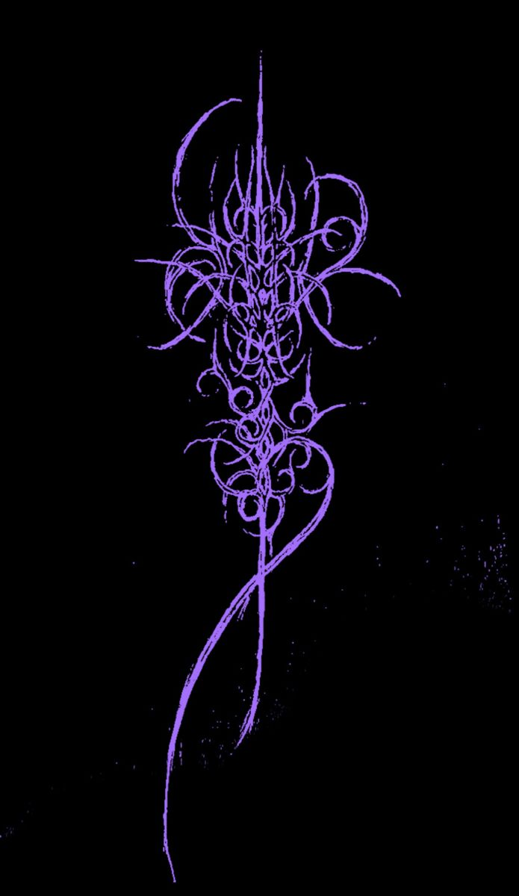

<!-- 
Alttaki src= kısmına repo nun içine attığın resimi banner olarak daha sonra eklenebilir.

-->
###

# 💫📜About Me:
👋Hi Everybody!  📊 I'm a Statistics student at [Hacettepe University🏫](https://hacettepe.edu.tr/)   👨‍💻 With a passion for data science, machine learning and deep learning.  💻 I'm creating and getting more knowledge in Python, R, SQL and 'really really' slowly C/C++.  🐱 Here on GitHub to share my projects, grow my skills, and keep learning -Actually I learn everything that develops and improves me— always building and exploring.  🎯 Dedication is everything, so keep moving.    and also ; btw I use Arch ^_~    💬 Ask me about; Statistics, Data Science, Machine Learning, Linux, Tennis, Cars and getting hot chicks 📫 How to reach me: There are must be some links in my profile, I believe u can find it ⚡ Fun fact: Some turtles can breathe through their butts! Seriously 😄 Certain freshwater turtles in Australia can absorb oxygen through a special area near their cloaca (a multipurpose opening), allowing them to stay underwater longer. It’s super helpful during hibernation or deep dives! [(Source)](https://en.wikipedia.org/wiki/Fitzroy_River_turtle)

## 🌐 Socials:
    

# 💻 Tech Stack:
       
# 📊 GitHub Stats:
 
 

### ✍️ Random Dev Quote

---

  ## 💰 You can help me by Donating
   

  
<!-- Proudly created with GPRM ( https://gprm.itsvg.in ) -->

<!--
# Hi!👋 About me.. 📜  @efekcss

📊 I'm a Statistics student at [Hacettepe University🏫](https://hacettepe.edu.tr/)  
👨‍💻 With a passion for data science, machine learning and deep learning. 
💻 I'm creating and getting more knowledge in Python, R, SQL and 'really really' slowly C. 
🐱 Here on GitHub to share my projects, grow my skills, and keep learning -Actually I learn everything that develops and improves me— always building and exploring. 
🎯 Dedication is everything, so keep moving. ( and also ; I use Arch btw 🐧 ) 

💬 Ask me about; Statistics, Data Science, Machine Learning, Linux, Tennis, Cars and getting hot chicks
📫 How to reach me: There are must be some links in my profile, I believe u can find it
⚡ Fun fact: Some turtles can breathe through their butts! Seriously 😄 Certain freshwater turtles in Australia can absorb oxygen through a special area near their cloaca (a multipurpose opening), allowing them to stay underwater longer. It’s super helpful during hibernation or deep dives! [(Source)](https://en.wikipedia.org/wiki/Fitzroy_River_turtle)

-->
<!--
**efekcss/efekcss** is a ✨ _special_ ✨ repository because its `README.md` (this file) appears on your GitHub profile.

Here are some ideas to get you started:

- 🔭 I’m currently working on ...
- 🌱 I’m currently learning ...
- 👯 I’m looking to collaborate on ...
- 🤔 I’m looking for help with ...
- 💬 Ask me about ...
- 📫 How to reach me: ...
- 😄 Pronouns: ...
- ⚡ Fun fact: ...
-->
